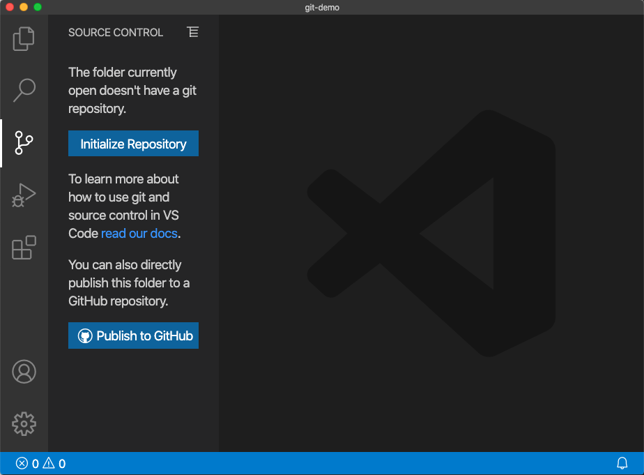
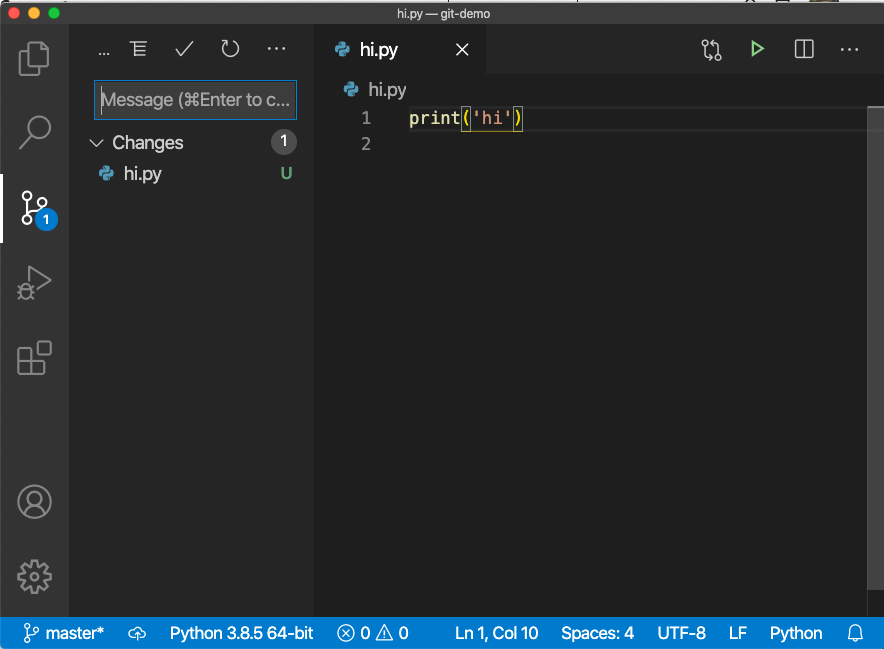
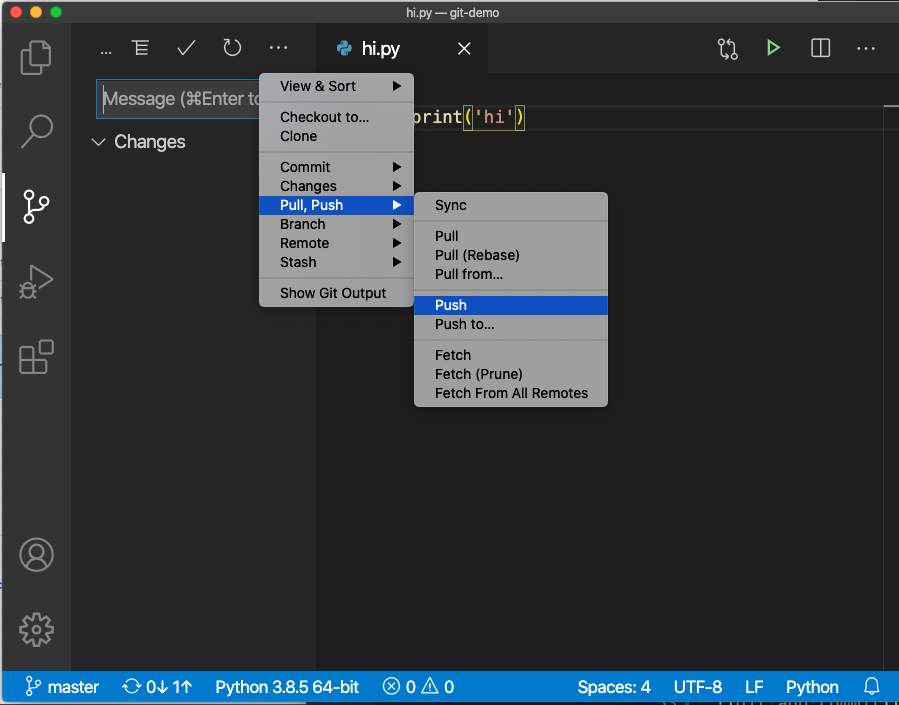

# Git and GitHub

If you want to track the change history of your code or work as a team, you should use Git. Git is the most popular software version management tool. In Git terms, a software project is called a repository. Git is a distributed software version control system. It keeps your source code in local and remote repositories and keeps track of all the changes (snapshot) of your software assets include source code, configuration, documents, pictures and etc.

GitHub is a cloud service that hosts Git repositories. Saving your repositories in GitHub to have a reliable and central control of your source code.

## 1 Setup

First of all, please go to [https://github.com](https://github.com) to create an account if you don't have one. You can create GitHub repositories using your account.

Then go to [https://git-scm.com/downloads](https://git-scm.com/downloads) to download and install the latest version of Git. In you command line interface (CLI), run `git --version` to verify the installation. The CLI in Windows is `cmd` or `power shell`, the CLI in Mac is a terminal.

After downloading and installing git in your local computer, use `git config --global user.name "Your Name"` to set up a global username for all your repositories. Use `$ git config --global user.email "YourEmail@any.com"` to configure an email for your repositories.

## 2 Use GitHub from VS Code

### 2.1 Create an Empty Project Folder

Create an empty folder in your computer, say `git-demo`. Then run VS code and open the newly created `git-demo` as the root of your project workspace.

### 2.2 Login to GitHub Account

Right click the left activity bar of your VS Code Windwo, check the `Account` to display the account icon. Click the account icon and login to your GitHub Account.

### 2.3 Create `.gitignore` File

Create a `.gitignore` file in your project root folder (the folder where `.git` folder sits) to add filenames or filename patterns for files that git should ignore. For example, MacOS user should ignore the system-generated `.DS_Store`. Add the `.DS_Store` line to `.gitignore` will work.

You can copy [a sample Python git igorefile](https://github.com/github/gitignore/blob/master/Python.gitignore) for your Python project and edit it to fit your needs. For example, add the `.DS_Store` line to the copied `.gitignore` file.

### 2.4 Create and Edit Your Project Files

Create the initial project files. You should commit and push your changes to GitHub frequently to not lose your changes.

### 2.4 Publish to GitHub

Then click the source control icon in the left of your VS Code window. If you don's see it, right click the left activity bar to enable it.

It shows two buttons: `Initialize Repository` and `Publish to GitHub`. Click `Publish to GitHub` and you can see two options: a private repository or a a public repository. For class project, use the public repository. VS code creates a Git repository in both your GitHub account and in the local folder. You can check there is a hidden folder `.git` in the `git-demo` folder. The `.git` folder has all Git repository data, please don't touch it. In Mac OS terminal, use `ls -la` to see all hidden folders/files. In Windows Explorer, [setting showing hidden files](https://support.microsoft.com/en-us/help/4028316/windows-view-hidden-files-and-folders-in-windows-10) to see the hidden folder.

### 2.5 Commit Locally

Create a new file or make some changes, then click the soruce control icon in activity bar, you can see the changes in your repository. Add a message describing the change and click the checkmark icon on the top to commit the change to local repository.

The changes are commited to the local repository in your computer. Actually they are in the `.git` folder.

### 2.5 Push to GitHub

You should push local changes to your GitHub repository frequently to have a safe stroage in cloud. There are two ways you can do it.

As show in the above picture

- you can use the push menu icon or
- you can click the sync icon at the bottom status bar

The sync icon is prefered because it only needs one click. There are two numbers and two arrows next to the sync icon: the number on the left of an up arrow shows how many commits in the GitHub that are not pulled down; the number on the left of the up arrow shows the number of commits not pushed up to GitHub.

## 3 Resources

- Document: [Working with GitHub in VS Code](https://code.visualstudio.com/docs/editor/github)
- Video: [How To Use GitHub with VS Code in 2020](https://youtu.be/OmX0o2iBVek)
- [YouTube Video: GitHub and GitHub](https://youtu.be/WUDzf_c2w0I).

The following sections are for those who want to learn more or need to troubleshoot GitHub issues.

## 4 Basic Git Concepts

Git keeps a history of your software changes by taking snapshots and store them in a `.git` directory of you project root folder. you can specify which files to be managed by a repository using `git add` command to **stage** file changes. The staging area is also called **cache** or **index**. You decide when to take a snapshot by issuing a `git commit` command. Git keeps all commit history and you can access any snapshot when you want.

The `git add` command and the `git commit` command work on a local repository. To save it in GitHub, you need to create a link between a local repository with a remote GitHub repository. There are two methods to create this link:

- Use `git clone github-repository-url` to clone a GitHub repository. The URL is displayed as a `Clone or download` green button in your GitHub repository page. This is recommended for a new project.
- Create a GitHub repository and use `git init` to create a local repository. Then use `git remote add` command to link the GitHub repository with the local repository. This is often used to save an existing project to GitHub.

Once you link a local repostiory with a remote repository, you can use `git push` to **push** changes to the remote repository or use `git pull` to **pull** changes made by others from the remote repository.

## 5 Using Git Command Line

This is an exmaple using Git Command line. It explains what happen behind the VS Code GUI.

### Step 1: Create a Repository

If you create a new repository in Github, please select the right project type to add an appropriate `.gitignore` file. Optionally, you can select a license to add a license copyright file.

### Step 2: Clone the Github Repository

In your Github repoistory page, you can find the url. Use `git clone remote-repository-url` to clone it. The command will create a new folder named after the repository name.

### Step 3: Work on Local Repository

Then work on this local repostiory. Add new files, change existing files or delete unused files.

### Step 4: Stage Changes

when you are ready, run `git add .` to stage all changed files.

### Step 5: Commit Changes

Use `git commit -m "your change message"` to commit changes and create a new snapshot.

Often you want to commit all changes. It is common to combine the staging and committing in one step using command `git commit -a -m "your change message"`.

### Step 6: Push to Github Repository

Use `git push -u origin master` to push the changes to the remote repository. You may be asked for the username and passord of the remote repository.

Here the `origin` is the original Github respository. The `master` is the master branch of the local repository. As a solo developer, usually you only use one master branch. Optionally you can have mutiple branches for different feature development. But it is another topic.

### Other Common Tasks

Use `git status` to check current status frequently.

Use `git log` to check the history.

use `git pull` to pull changes from remote repository made by other developers.
