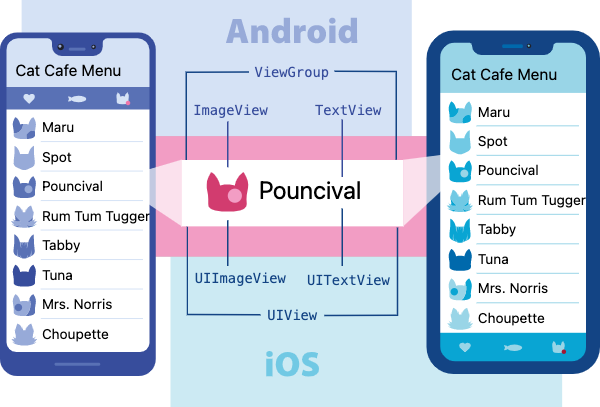

# JSX

## Rational

JSX is a JavaScript syntax extension used to describe UI components. RN is designed with the view that rendering logic is inherently coupled with UI logic such as event handling and state management. Therefore JSX consists of declarative UI description and JavaScript code. JSX is a syntac sugar for JavaScript code. It makes UI description much simpler than pure JavaScript code.

Using JSX, you can write markup inside Javascript, providing you with a superpower to write logic and markup of a component inside a single jsx file.

## Compile JSX

Because RN uses `React` to compile JSX, you need to import it first as: `import React from 'react'` even you don't use it directly in your code.

## Views and Components

From [React Native Document](https://reactnative.dev/docs/intro-react-native-components):

> In Android and iOS development, a view is the basic building block of UI: a small rectangular element on the screen which can be used to display text, images, or respond to user input. Even the smallest visual elements of an app, like a line of text or a button, are kinds of views. Some kinds of views can contain other views. It’s views all the way down!



React Native uses components that are backed by the corresponding Android and iOS views. These platform-backed components are called `Native Components`. RN provides a set of commonly used Native comonents. These are RN's [Core Components](https://reactnative.dev/docs/components-and-apis).

A component is an individual resualble piece of UI. A component has one or more views. React components are created by using their tags, either with or without closing tag. For example: `<Text>content</Text>` or `<Button title="Click" />`. It uses the same HTML syntax with different tag name. The RN built-in and custom components use capitalized names.

Use component property names to initialize its props. A single prop without assingment has a default value of `true`. For example: `<MyTextBox autocomplete />` is the same as `<MyTextBox autocomplete={true} />`.

## Embedding Expressions in JSX

JavaScript expressions inside JSX will be evaluated to a string, a RN component or a list of strings/components. You can embed JavaScripit expressions in JSX by putting them inside a pair of curly bracket `{expression}`. For example:

```javascript
function formatName(user) {
  return user.firstName + " " + user.lastName;
}

const user = {
  firstName: "Harper",
  lastName: "Perez",
};

const element = <h1>Hello, {formatName(user)}!</h1>;
```

## Resource

[Introducing JSX](https://reactjs.org/docs/introducing-jsx.html)
