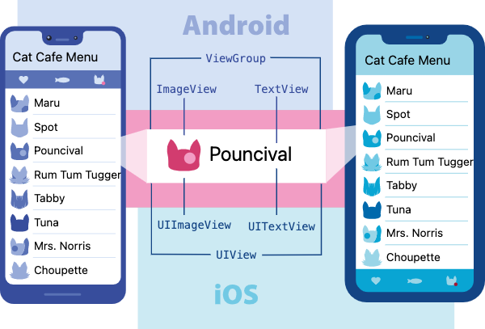

# Style and Layout

## 1 View, Components and Elements

From [React Native Document](https://reactnative.dev/docs/intro-react-native-components):

> In Android and iOS development, a view is the basic building block of UI: a small rectangular element on the screen which can be used to display text, images, or respond to user input. Even the smallest visual elements of an app, like a line of text or a button, are kinds of views. Some kinds of views can contain other views. It’s views all the way down!



React Native uses components that are backed by the corresponding Android and iOS views. These platform-backed components are called `Native Components`. RN provides a set of commonly used Native comonents. These are RN's [Core Components](https://reactnative.dev/docs/components-and-apis). Components are composable -- it means that a component can have one or more sub components. It is an individual resualble piece of a React App.

A component rendered in a screen is called a React **Element**. Elements in a screen are organized as a tree. Formally, the component is the `type` of rendered element. A component may have many properties (called `props`) such as `style` or component-specific setup data. For example, a `<Button>` component has a `title` prop to specifies the button text. You use component property names to initialize its props. For exxmple, `<Button title="Submit" />`.

In summary, when you create a UI element, you use JSX to specify a component as its type and provide one or more props (including `style`) to initialize its view.

## 2 Style

All RN core components accept a `style` property. The value is an object whose property names are CSS style names and values are CSS values. Because JavaScript doesn't allow `-` in a property name, you should use camel casing names. For example, use `backgroundColor` instead of `background-color`, use `fontSize` instead of `font-size`.

All dimensions such as `width` and `height` in React Native are unitless, and represent density-independent pixels.

The common practice is to use `StyleSheet.create` define several styles for subcomponents in one place. You can define inline styles using JS object. The following example uses both styles:

```jsx
import React from 'react';
import { Text, View } from 'react-native';

export default function App() {
  return (
    <View style={styles.container}>
      <Text
        style={{
          fontSize: 20,
          color: 'teal',
        }}
      >
        Hello, world!
      </Text>
    </View>
  );
}

const styles = StyleSheet.create({
  container: {
    flex: 1,
    justifyContent: 'center',
    alignItems: 'center',
  },
});
```

## 3 Layout

### 3.1 Layout with Flexbox

RN layout is based on Flexbox. The [Layout with Flexbox](https://reactnative.dev/docs/flexbox) is a must-read. Follwoing are commonly used styles:

- Container Styles
  - `flexDirection`: this defines the `main axis`, can be either `column` or `row`. In RN, default is `column`. Items are placed from top to bottome.
  - `justify-content`: this defines the alignment of items along the main axis. Common values are `flex-start`, `flex-end`, `center`, `space-between`, `space-around` and `space-evenly`.
  - `align-items`: this defines the alignment of items along the cross axis. Common values are `stretch`, `flex-start`, `flex-end`, `center`, and `baseline`.
  - `align-content`: this aligns the container's lines when there is extra space in cross-axis. Values are `flex-start`, `flex-end`, `center`, `stretch`, `space-between`, and `space-around`.
- Item Styles
  - `flex`: a single value defines the relative size of the item.
  - `align-self`: this overrides container's `align-items`value for this item.

### 3.2 The Yaga Engine

The RN layout engine is called [Yaga](https://yogalayout.com/). It is based on the CSS flexbox layout with a few exceptions.

- `flexDirection` defaulting to `column` instead of `row`.
- `alignContent` defaulting to flex-start instead of stretch
- the `flex` parameter only supporting a single number.

Many RN components are both containers and items thus they use all the above styles. The [Yaga Documentation](https://yogalayout.com/docs) describes each properties and gives some examples. You can try with its [Palyground](https://yogalayout.com/playground).

## 4 Resources

### 4.1 RN Resources

- [React Native Introduction](https://reactnative.dev/docs/getting-started)
- [RN style document](https://reactnative.dev/docs/style)
- [a complete guide to flexbox](https://css-tricks.com/snippets/css/a-guide-to-flexbox/): The first three subjects.
- [RN Layout with Flexbox](https://reactnative.dev/docs/flexbox)

### 4.2 W3C Flexbox Resources

CSS uses box model for UI style. Flexbox stands for flexible box that is a W3C recommended method to lay out, align and distribute space among items in a container.

You can learn the basics from [a complete guide to flexbox](https://css-tricks.com/snippets/css/a-guide-to-flexbox/). Pay attention to concepts such as `main axis`, `cross axis`, `flex direction`, `align items` and `justify content`. There are properties for the container and properties for the items.

You can ues [Flexbox Froggy](https://flexboxfroggy.com/) to play and learn the layout.
